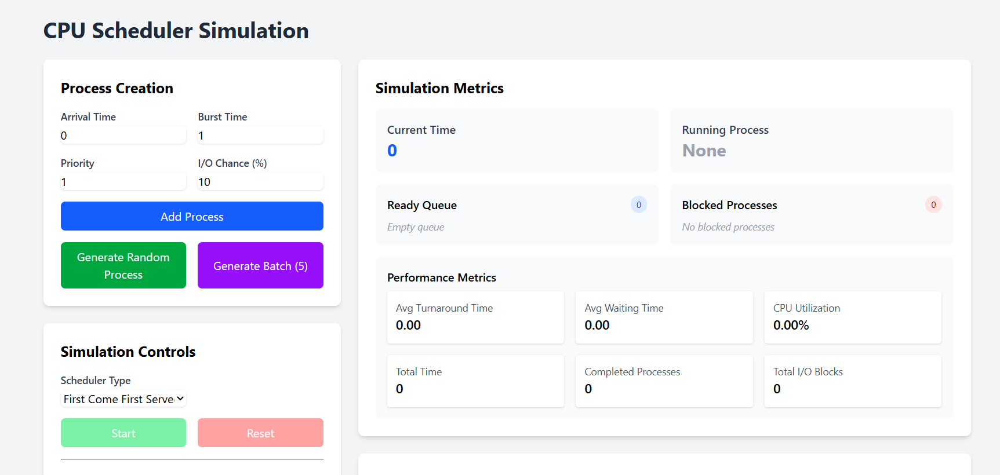

# CPU Scheduler Simulator

A comprehensive, interactive CPU scheduler simulation tool that demonstrates the behavior and performance of various CPU scheduling algorithms in operating systems. This application provides real-time visualization of process execution, queue management, and performance metrics.

## 🔍 Project Overview

This project simulates how a CPU scheduler manages processes in an operating system. It demonstrates different scheduling algorithms and provides visual feedback on their performance characteristics. The simulator helps students and professionals understand the trade-offs between different scheduling approaches.

## ✨ Features

### Scheduling Algorithms
- **First-Come-First-Served (FCFS)**: Non-preemptive scheduling based on arrival time
- **Shortest Job First (SJF)**: Non-preemptive scheduling based on burst time
- **Priority Scheduling**: Non-preemptive scheduling based on process priority
- **Round Robin (RR)**: Preemptive scheduling with time quantum
- **Priority Round Robin**: Combination of priority scheduling and round robin

### Interactive Process Management
- Create processes with customizable parameters (arrival time, burst time, priority, I/O chance)
- Generate random processes with configurable distributions
- Remove processes from the queue
- Import/export processes from JSON or CSV files

### Visualization & Analytics
- Real-time Gantt chart showing process execution timeline
- Interactive timeline with playback controls (play, pause, speed adjustment)
- Display of ready and blocked queues at each time step
- Point-in-time visualization (click on timeline to see system state at that moment)
- Detailed performance metrics calculation:
  - Average turnaround time
  - Average waiting time
  - CPU utilization
  - Throughput
  - I/O handling metrics

### Simulation Controls
- Start/stop/reset simulation
- Adjust time quantum for round robin algorithms
- Save final performance metrics for comparison

### Visual Reports: 
- Generate charts and graphs visualizing performance differences


## 🛠️ Technologies Used

### Backend
- **Python 3.x**: Core programming language
- **Flask**: Web server framework
- **Flask-SocketIO**: Real-time bidirectional communication
- **JSON/CSV**: Process data storage formats

### Frontend
- **Vue.js**: Frontend framework
- **Pinia**: State management
- **Socket.io-client**: Real-time client-server communication
- **Tailwind CSS**: Utility-first CSS framework

## 🏗️ Architecture

The project follows a client-server architecture:

- **Backend**: Handles the core scheduling algorithms, process management, and simulation logic
- **Frontend**: Provides the user interface, visualization, and interactive controls
- **Communication**: Real-time bidirectional communication using WebSockets (Socket.IO)

## 📦 Installation & Setup

### Prerequisites
- Python 3.x
- Node.js and npm

### Backend Setup
```bash
# Navigate to backend directory
cd backend

# Install dependencies
pip install flask flask-socketio eventlet

# Run the server
python app.py
```
### Backend Setup
```bash
# Navigate to frontend directory
cd frontend

# Install dependencies
npm install

# Run the development server
npm run dev
```

## 📝 Usage Guide
1. Create Processes:

- Manually add processes with specific parameters
- Generate random processes
- Import processes from a file
2. Configure the Scheduler:

- Select a scheduling algorithm
- Set time quantum for Round Robin schedulers
3. Run the Simulation:

- Click "Start" to begin the simulation
- Watch the real-time visualization
- Use playback controls to navigate through the timeline
4. Analyze Results:

- Review performance metrics
- Examine the Gantt chart
- Click on timeline points to inspect system state at specific times
5. Save or Reset:

- Export processes to a file for later use
- Reset the simulation to try different parameters


## 📁 Project Structure
```
CPU_Scheduler/
│
├── backend/
│   ├── app.py                  # Flask application & Socket.IO handlers
│   ├── process.py              # Process class definition
│   ├── process_manager.py      # Process creation and file handling
│   ├── schedulers.py           # Scheduling algorithms
│   └── simulation.py           # CPU simulation logic
│
└── frontend/
    ├── public/                 # Static assets
    ├── src/
    │   ├── assets/             # CSS and other assets
    │   ├── components/         # Vue components
    |   |   ├── ComparisonReport.vue # comparaison dashboard 
    │   │   ├── GanttChart.vue  # Timeline visualization
    │   │   ├── MetricsDisplay.vue # Performance metrics display
    │   │   ├── ProcessForm.vue # Process creation interface
    │   │   ├── ProcessList.vue # Process management interface
    │   │   └── SimulationControls.vue # Simulation controls
    │   ├── stores/
    │   │   └── simulation.js   # Pinia store for state management
    │   ├── App.vue             # Main application component
    │   └── main.js             # Application entry point
    ├── package.json            # Dependencies and scripts
    └── tailwind.config.js      # Tailwind CSS configuration

```


## 🧠 Learning Outcomes
This simulator helps visualize and understand:

- How different scheduling algorithms affect process execution order
- The impact of scheduling on system performance metrics
- The trade-offs between fairness, throughput, and response time
- How I/O operations affect CPU utilization
- The effect of time quantum selection on Round Robin performance


## 👥 Credits
Developed as part of an Operating Systems course project by Oussama Laaroussi & Mohamed Ayman Bourich